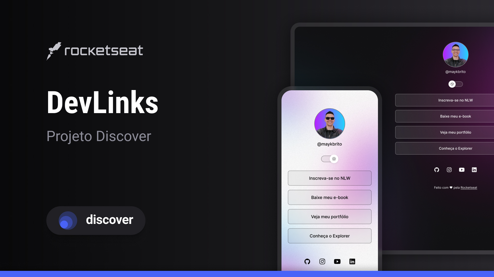

<h1>DevLinks</h1>

Projeto executado por Pedro Guedes sob aprendizado do curso promovido pela Rocketseat para ensino de tecnologias WEB.

<a href="#-tecnologias">Tecnologias</a>   |    <a href="#-projeto">Projeto</a>   |    <a href="#-layout">Layout</a>   |    <a href="#-licença">Licença</a>

<h2>DevLinks</h2>

## 🚀 Tecnologias
Esse projeto foi desenvolvido com as seguintes tecnologias:

HTML e CSS
JavaScript
Git e Github
Figma

## 💻 Projeto
Linktree que serve como cartao de visitas online para devs.

## 🔖 Layout
Você pode visualizar o layout do projeto através [DESSE LINK](https://www.figma.com/file/WF58jzFbw7F93r8ctb4wqU/DevLinks-%E2%80%A2-Projeto-Discover-(Community)?type=design&node-id=10%3A620&mode=design&t=ozCsl1N0y9hI1f9L-1). É necessário ter conta no [Figma](http://figma.com) para acessá-lo.

## 📝 Licença
Esse projeto está sob a licença MIT.

Feito por Pedro Guedes

